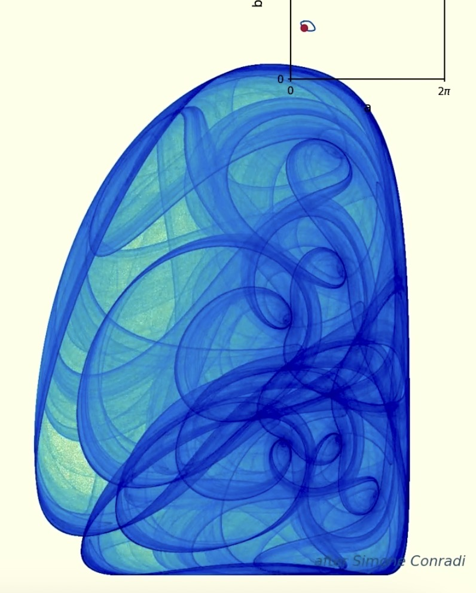

# Trigonometric attractor




A recreation of the Simone Conradi animation:

```
x_{n+1} = sin(x_n^2 - y_n^2 + a)
y_{n+1} = cos(2 x_n y_n + b)
```

Since `(x^2 - y^2, 2xy)` are the real/imaginary parts of `z^2` (with `z = x + iy`),
this is really `z -> ( sin(Re z^2 + a), cos(Im z^2 + b) )`.

## How it works

Every starting point is pulled onto the same attractor, so each frame scatters a
large cloud of random initial points, iterates the map, discards a short burn-in,
and accumulates every visited position into a 2D histogram. That density is
log-scaled, gamma-lifted, and run through a custom pale-yellow → green → teal →
navy colormap.

The animation walks the parameters `(a, b)` once around a small loop in parameter
space — the little loop drawn in the top-right inset — and the attractor morphs as
it goes. The dot's *speed* is warped by local richness so it lingers on the
structured frames and rushes through the thin near-1D arcs.

## Two projects

This repo runs **two parallel projects off one shared engine**:

- **`original/`** — Conradi's football loop (his path, recreated).
- **`ours/`** — our own loop, traced through the rich regions of parameter space.

The Python lives at the repo root and is shared. Each project keeps only its own
**outputs** in its folder:

```
original/                         ours/
  loop_config.json   (overwritten   loop_config.json
  videos/             on re-trace)   videos/
  reviews/                           reviews/
  stills/                            stills/
```

## Versioning (how reviews and videos stay matched)

Outputs are named after a short **hash of the loop shape**, so the review image
and the movie rendered from the same loop share a prefix:

```
ours/reviews/ours_ced1ac89.png        <- review of this shape
ours/videos/ours_ced1ac89_high.mp4    <- movie of the same shape
ours/videos/ours_ced1ac89_high_2.mp4  <- re-render: auto-bumped, never overwrites
```

Trace a **new** shape → new hash → a fresh set of files; nothing old is lost.
Re-trace the same project just overwrites its `loop_config.json` (the only file
that gets overwritten). Movies auto-append `_2`, `_3`, … if a file is already
there, so a re-render never clobbers an earlier one.

## Usage

Run everything from the repo root.

**Original (Conradi's loop):**

```bash
python3 trace_loop.py            # (GUI) trace his football -> original/loop_config.json
python3 review_grid.py           # -> original/reviews/original_<hash>.png
python3 animate.py movie --quality high          # -> original/videos/original_<hash>_high.mp4
python3 animate.py still --t 0.25 --quality high # -> original/stills/
```

**Ours (our loop):**

```bash
python3 trace_ours.py            # (GUI) trace our loop -> ours/loop_config.json
python3 review_ours.py           # -> ours/reviews/ours_<hash>.png
python3 animate_ours.py movie --quality high     # -> ours/videos/ours_<hash>_high.mp4
python3 animate_ours.py still --t 0.25           # -> ours/stills/
```

Movie defaults: `--frames 810 --fps 30 --quality medium --warp 1.4` (810 frames
@ 30 fps = 27 s). For a 30-second render use `--frames 900`. Wrap long renders in
`caffeinate -i` to keep the Mac awake:

```bash
caffeinate -i python3 animate_ours.py movie --quality draft --frames 900   # quick draft
caffeinate -i python3 animate_ours.py movie --quality high  --frames 900   # final
```

Quality presets (`draft` / `medium` / `high`) trade render time for point count
and histogram resolution (the video is always 1050×1050).

## Files

- `attractor.py` — the map, density accumulation, colormap, rendering
- `loops.py` — loop geometry (ellipse / traced points), save/load, grid calibration
- `paths.py` — per-project output layout + shape-hash versioning
- `explore.py` — fast coverage heatmap of parameter space (cached to `img/coverage.npy`)
- `animate.py` — figure layout (equation + inset + signature) + the still/movie engine and CLI
- `animate_ours.py` — same engine, pointed at the `ours/` project
- `trace_loop.py` / `trace_ours.py` — interactive loop tracers (need a GUI window)
- `review_grid.py` / `review_ours.py` — build the loop review images
- `img/` — shared assets (Conradi's `grid.jpg`, cached coverage, reference photos)

Requires `numpy`, `matplotlib`, and `ffmpeg` (for the movie).
